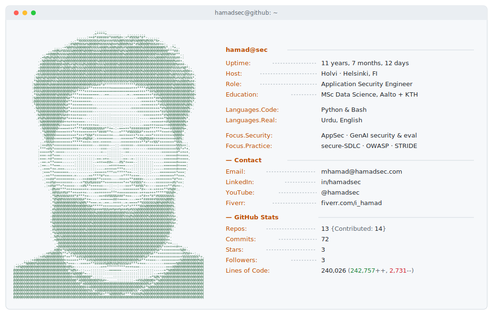

<picture>
  <source media="(prefers-color-scheme: dark)"  srcset="./dark_mode.svg">
  <source media="(prefers-color-scheme: light)" srcset="./light_mode.svg">
  
</picture>

# Muhammad Hamad

**Application Security Engineer** · Django/Python · GenAI security & evaluation · ISO 27001 / DORA · Springer-published researcher.

I work at the intersection of software engineering and cybersecurity. I read, write, and modify production Django/Python code to find vulnerabilities through white-box review, fix them at the source, and build secure-by-default abstractions so the same class of bug stops appearing.

## Selected work

**PureBiasoMeter — LLM Fairness Evaluation** (Springer CCIS, 2026) — co-first author with KTH's Distributed Systems group. A diagnostic framework for evaluating fairness in LLM-based recommender systems.
- Code: [github.com/Hamad-Security/LLM-Bias-Fairness-Assessment](https://github.com/Hamad-Security/LLM-Bias-Fairness-Assessment)
- Paper: [doi.org/10.1007/978-3-032-13342-7_14](https://doi.org/10.1007/978-3-032-13342-7_14)

## Currently

Cybersecurity Engineer @ **Holvi** (Helsinki/Espoo, Finland). MSc Data Science at **Aalto University + KTH Royal Institute of Technology** (joint EIT Digital programme). Open to AppSec / Product Security collaborations, secure-SDLC tooling, and AI-for-security / security-of-AI research.

## Stack

`Django` · `Python` · `SonarQube` · `Dependency-Track` · `AWS` · `ELK` · `Datadog` · `Sentry` · `ISO 27001` · `DORA` · `OWASP` · `STRIDE` · `CWE` · LLM-assisted security tooling.

## Certifications

CEH Practical · eJPTv2 · INE Certified Cloud Associate (ICCA).

## Connect

- LinkedIn: [linkedin.com/in/hamadsec](https://linkedin.com/in/hamadsec)
- Email: [mhamad](mailto:mhamad758@gmail.com)@hamadsec.com
- Fiverr: [fiverr.com/i_hamad](https://fiverr.com/i_hamad)
